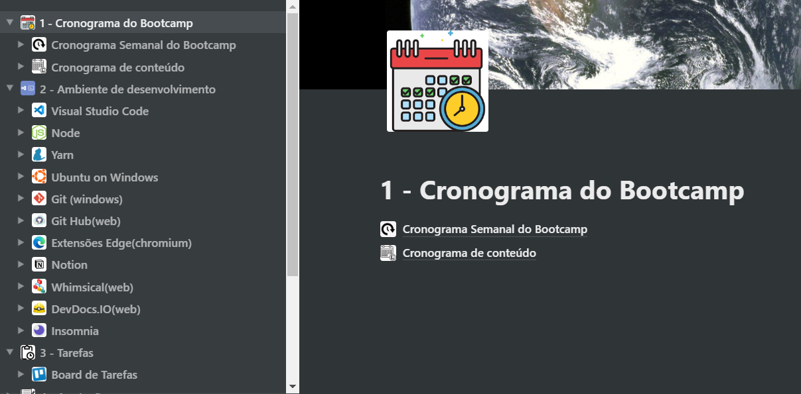
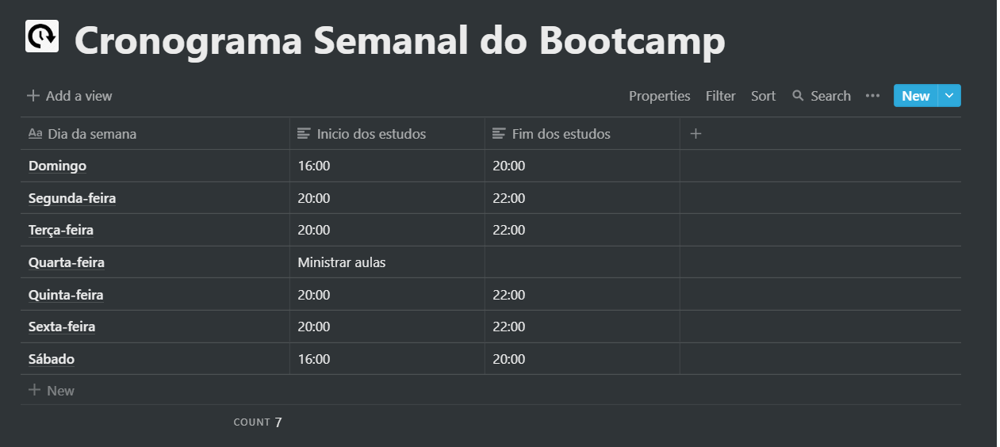
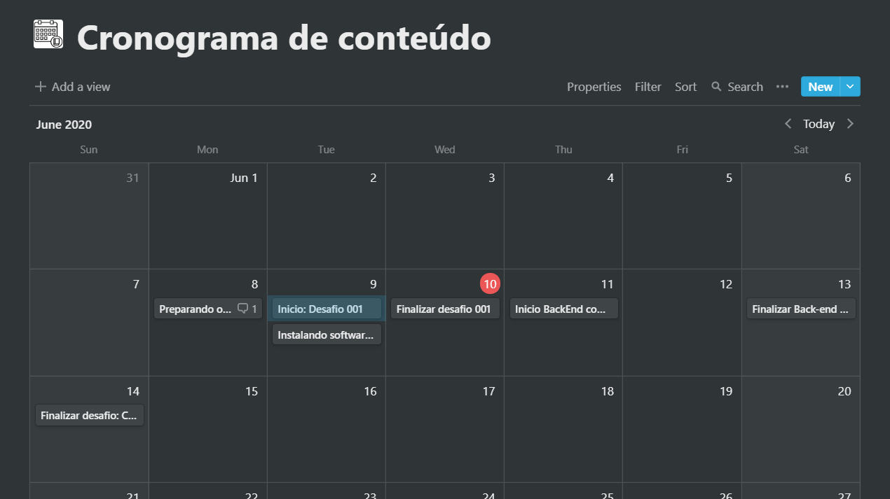

# Bootcamp_GoStack_Desafios
Repositório criado para inclusão dos desafios realizados no bootcamp

<h3 align="center">
  Desafio 1: Planejando meus estudos
</h3>

<blockquote align="center">“Sua única limitação é você mesmo”!</blockquote>

  

  <a href="#rocket-sobre-o-desafio">Sobre o desafio</a>&nbsp;&nbsp;&nbsp;|&nbsp;&nbsp;&nbsp;
  <a href="#calendar-entrega">Entrega</a>&nbsp;&nbsp;&nbsp;|&nbsp;&nbsp;&nbsp;
  <a href="#memo-licença">Licença</a>

## :rocket: Sobre o desafio

Nesse desafio, a proposta é que planeje meus estudos antes de sair correndo para <I>codar</I>.

Para isso, foi solicitada a criação de um cronograma que irá se adaptar ao meu tempo e ritmo.

Definido meu horário de estudo, criei tarefas atreladas a um calendário, visando me manter com foco e sempre alinhado com seus objetivos!

### Cronograma

Baseado no que foi aprendido até o momento no Bootcamp sobre organização e planejamento, foi gerado o seguinte cronograma, desenvolvido no software <b><I>Notion</I></b>.

O Notion funciona tanto em plataformas mobile, tanto em plataformas desktop, e ambas podem ser baixadas em sua [página oficial](https://www.notion.so/product).

Se ficou interessado pela metodologia da Rocketseat, o meu cronograma pode ser acessado no link abaixo:

📄 **[Cronograma_Bootcamp](https://www.notion.so/1-Cronograma-do-Bootcamp-fdcf632303a0462db0557235c069826e)**

#### Definindo o cronograma geral e detalhando o necessário para aprendizado no Notion:

  

Aqui foi organizado uma visão simples sobre as ferramtens a serem utilizadas no bootcamp, as tarefas e os cronogramas para as primeiras aulas! Go Rocket!!!

#### Definindo o cronograma semanal - horário de estudo:

  

Nessa sessão foram informados os horários fixos que dedicarei durante a jornada como dev, afinal conforme o Diego, a rotina de estudos será o primeiro passo para se conseguir atingir os objetivos o mais rápido possível!

#### Definindo o cronograma diário:

  

Agora foram planejadas as tarefas diárias de modo que eu esteja preparado para todo o conteúdo que irei consumir durante a semana.

## :calendar: Entrega

Esse desafio será entregue na plataforma Skylab. Após concluído será criado um post no Linkedin sobre ele, visando demonstrar os esforços  para evoluir em minha carreira e para oportunidades futuras.

## :memo: Licença

Esse projeto está sob a licença MIT. Veja o arquivo [LICENSE](LICENSE) para mais detalhes.

---

Feito com 💜 by RodrigoMonteiro :wave: [Entre na nossa comunidade!](https://discordapp.com/invite/gCRAFhc)
